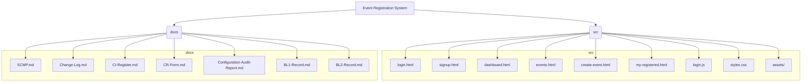

# Software Configuration Management Plan (SCMP)

Mini Event Registration System

## 1. Purpose and Scope
The purpose of this Software Configuration Management Plan (SCMP) is to define the configuration management activities, policies, and procedures to be followed during the development of the Mini Event Registration System project. This document serves as a guideline for identifying, organizing, controlling, and tracking all project artifacts throughout the project lifecycle.

The SCMP ensures that all configuration items (CIs), including documents, source code, and data files, are consistently managed and protected from unauthorized or uncontrolled changes. It also establishes a structured approach for handling modifications through a formal change control process.

The scope of this SCMP covers all phases of the project, starting from repository initialization, documentation preparation, feature development, change management, baseline creation, release management, and configuration auditing. This plan applies to all team members involved in the project and remains effective until the project is formally completed and released.

## 2. Project Overview
The Mini Event Registration System is a simple web-based application designed to demonstrate the application of Software Configuration Management principles. The system allows users to sign up, log in, view a list of available events, create their own events, and register for events created by others.

The project is built with client-side technologies (HTML, CSS, JavaScript) and uses the browser's `localStorage` to simulate a database for users, events, and registrations. This focus on the frontend avoids complex backend setup and keeps the emphasis on SCM practices like version control, documentation, change tracking, and release management.

### 2.1 Project Structure
The repository is organized into two main directories:
- `docs/`: Contains all project documentation, including this SCMP, the Change Log, CI Register, and baseline records.
- `src/`: Contains all source code for the web application, including HTML pages, CSS styles, JavaScript logic, and static assets.

## 3. Roles and Responsibilities
To ensure effective Software Configuration Management, the project team is organized into clearly defined roles. Each role has specific responsibilities to support proper planning, development, control, and documentation activities.

### 3.1 SCM Manager
The SCM Manager is responsible for planning and overseeing all configuration management activities. This role ensures that SCM policies and procedures defined in this SCMP are followed, approves baselines and releases, and coordinates configuration audits.

### 3.2 Developers
The Developers are responsible for implementing system features, updating source code, and resolving issues according to approved Change Requests. They work on feature branches and ensure that all changes are properly committed, documented, and submitted through pull requests. Both developers have equal job classification and share responsibilities and ownership across source code CIs:

### 3.3 Configuration Controller
The Configuration Controller maintains the integrity of configuration items by tracking versions, managing the CI Register, and ensuring that only approved changes are included in baselines and releases.

### 3.4 Reviewer / Quality Assurance (QA)
The Reviewer is responsible for reviewing Change Requests and pull requests to ensure that changes meet project requirements and follow SCM standards. This role helps maintain quality and stability before changes are merged into the main branch.

### 3.5 Documentation Manager
The Documentation Manager is responsible for preparing, updating, and maintaining project documentation, including the SCMP, CI Register, Change Logs, and audit reports. This role ensures consistency between documents and repository content.

### 3.6 Role Assignments
- Reviewer / QA: Saron Abebe 
- SCM Manager: Sefina Kamile 
- Documentation Manager: Selamawit Demissie 
- Configuration Controller: Yeabsira Molalign 
- Developers (equal classification): Solomon Abate, Tsion Gashaw 

## 4. Configuration Item (CI) Identification
Configuration Items (CIs) are project artifacts that are subject to configuration control. Identifying CIs ensures that all important project components are tracked, versioned, and managed consistently. For the Mini Event Registration System, configuration items include but are not limited to:
- Project documentation files
- Source code files
- Data files
- Repository configuration files

Each CI is uniquely identified by its name, version number, owner, category, and current status. Ownership is assigned per the Role Assignments above. A detailed CI Register is maintained in docs/CI-Register.md to record and monitor all configuration items throughout the project lifecycle.

## 5. Naming Conventions
To maintain consistency and clarity, standard naming conventions are applied to all project artifacts. File names use lowercase letters with hyphens where appropriate. Descriptive names are chosen to clearly reflect the purpose of each file.

Document names follow a standardized format such as SCMP.md, CI-Register.md, and Change-Log.md. Source code files use meaningful names like login.html and events.html. Version numbers follow a semantic versioning format such as v1.0 and v1.1 to indicate major and minor updates. These conventions help prevent confusion, improve traceability, and simplify configuration audits.

## 6. Versioning Rules
Version control is implemented using Git. Each meaningful change to a configuration item is recorded as a commit with a clear and descriptive commit message. Commits provide a historical record of changes and enable rollback if necessary. Git tags are used to mark important project milestones such as baselines and releases. Baseline tags (e.g., BL1, BL2) represent stable snapshots of the project at specific points in time. Release tags (e.g., v1.0, v1.1) represent officially released versions of the system. Version numbers are updated whenever changes significantly impact functionality, documentation, or system structure.

## 7. Branching Model
A simple and effective branching model is adopted to support parallel development and controlled integration of changes.

The following branches are used:
- `main`: Contains stable and approved versions of the project.
- Feature branches: Used for implementing changes (for this course deliverable, features were implemented on `feature-login`).

Default branch: `main`  
Current working branch: `feature-login`

All development work is performed on feature branches and merged into `main` using pull requests. This approach ensures that the `main` branch always remains stable and well-controlled.

## 8. Change Control Process
Change control is a critical component of Software Configuration Management. Any modification to a configuration item must follow a formal Change Request (CR) process to ensure that changes are justified, reviewed, and approved before implementation.

The change control process follows these steps:
1. A Change Request is submitted describing the proposed change.
2. The change is reviewed by the Reviewer and SCM Manager.
3. Approved changes are implemented on a feature branch.
4. The change is tested and verified.
5. The change is merged into the main branch and documented in the Change Log.

For course deliverables, CRs are capped at three umbrella requests (CR-01..CR-03). Smaller changes are batched under these CRs and documented in Change-Log.md and CR-Form.md accordingly.

This structured approach prevents unauthorized changes and ensures traceability of all modifications.

## 9. Baseline Management
Baselines represent approved and stable versions of the project. They serve as reference points against which future changes are measured.

Two baselines are defined for this project:
- Baseline 1 (BL1): Includes initial repository setup, project documentation, and CI identification.
- Baseline 2 (BL2): Includes a working prototype with approved Change Requests implemented.

Each baseline is tagged in Git and accompanied by a Baseline Record document describing its contents and purpose.

## 10. Release Management
Release management ensures that stable and approved versions of the system are formally delivered. Two releases are planned for the project:
- Release v1.0: The initial working version of the Mini Event Registration System.
- Release v1.1: An updated version incorporating approved changes and improvements.

Release-to-CR mapping:
- v1.0: CR-01, CR-02
- v1.1: CR-03

Each release includes release notes describing new features, changes, and fixed issues. Releases are published using GitHub Releases to maintain a clear and accessible delivery history.

## 11. Configuration Audits
Configuration audits are conducted to verify compliance with SCM procedures and ensure configuration integrity. Two types of audits are performed:

### 11.1 Physical Configuration Audit (PCA)
The PCA verifies that all configuration items listed in the CI Register exist in the repository, are correctly named, and have consistent version numbers.

### 11.2 Functional Configuration Audit (FCA)
The FCA verifies that implemented features meet the stated requirements and that approved Change Requests have been correctly applied. Audit findings are documented in a Configuration Audit Report.

## 12. Tools Used
The following tools are used to support SCM activities in this project:
- Git for version control
- GitHub for repository hosting, branching, pull requests, and releases
- Visual Studio Code for code and document editing
- GitHub repository: Seludemisse/scm-event-registration-system

These tools collectively support effective configuration management and collaboration.
